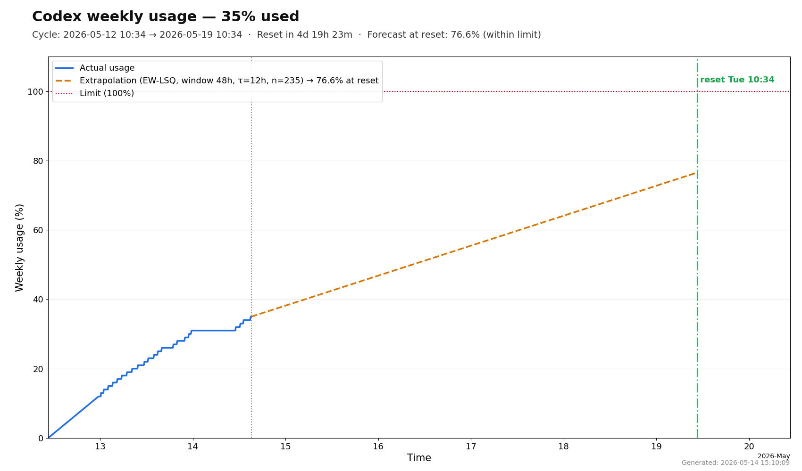

# Codex usage charts

This repository contains a periodic sampler for the `codex` CLI `/status` panel. It captures
`Weekly limit` samples, writes an append-only CSV, and renders a single PNG chart that can be
served publicly.

## Outputs

| File | Purpose |
| ---- | ------- |
| `codex_usage_data.csv` | Append-only time series, one row per successful sample |
| `codex_usage_statistics.png` | Rendered chart: actual usage + forecast to next reset |
| `errors.txt` | Timestamped errors written on failures |
| `tmp/capture-*.log` | Raw PTY captures from successful `codex` runs, rotated to keep latest logs |

A sample dashboard image is included in this repository: `codex.png`:



## Quick start

```sh
pip install -r requirements.txt
python main.py
```

## Exit codes

- `0` — success
- `1` — transient failure after retries
- `2` — `codex` CLI not installed
- `3` — `codex` session not authenticated

## Scheduling

Run `main.py` from cron or Task Scheduler. Recommended cadence is 10–15 minutes, but any interval works
because the chart interpolates between collected points.

```sh
# Example: every 10 minutes
*/10 * * * * cd /path/to/repo && /usr/bin/python3 main.py >> /var/log/codex-usage.log 2>&1
```

## Publishing the chart (optional)

Publishing is optional and disabled by default for safety. Configure through environment variables.

| Variable | Description |
| --- | --- |
| `CODEX_USAGE_PUBLISH` | Enable rsync upload when set to `1`, `true`, `yes`, or `on` |
| `CODEX_USAGE_PUBLISH_REMOTE` | Publish base target, e.g. `demo-user@public.example.com:/var/www/html/demo` |
| `CODEX_USAGE_REMOTE_PNG` | Remote PNG filename (default `codex.png`) |
| `CODEX_USAGE_REMOTE_ERROR` | Remote error log filename (default `errors.txt`) |
| `CODEX_USAGE_SSH_KEY` | Optional absolute path to SSH key used by rsync |

`main.py` composes the final destination as:

- `CODEX_USAGE_PUBLISH_REMOTE` + `/` + `CODEX_USAGE_REMOTE_PNG`
- `CODEX_USAGE_PUBLISH_REMOTE` + `/` + `CODEX_USAGE_REMOTE_ERROR`

## Example (demo values)

```sh
export CODEX_USAGE_PUBLISH=1
export CODEX_USAGE_PUBLISH_REMOTE="demo@public.example.com:/var/www/demo"
export CODEX_USAGE_REMOTE_PNG="codex.png"
export CODEX_USAGE_REMOTE_ERROR="errors.txt"
# export CODEX_USAGE_SSH_KEY="$HOME/.ssh/demo-deploy"
```

## FreeBSD move-to-www helper

`crontab_freebsd.sh` is a minimal helper for moving generated PNGs from one folder to another.
It uses environment-driven defaults and has no hardcoded usernames, hosts or internal paths.

| Variable | Description |
| --- | --- |
| `CODEX_USAGE_SOURCE_DIR` | Source directory with generated PNG files (default `/tmp/codex-demo`) |
| `CODEX_USAGE_DEST_DIR` | Destination directory served by web server (default `/var/www/html/demo`) |

## Chart semantics

- **Blue line**: observed usage points inside the current weekly cycle.
- **Orange dashed line**: forecast to reset time.
- **Red dotted line**: hard 100% limit.
- **Vertical line**: current local time and next cycle reset.

Forecasting model:

- EW-LSQ slope over samples inside a 48 hour cap (`LSQ_WINDOW_HOURS`) with decay (`LSQ_DECAY_HOURS=12`).
- Uses at least 3 samples spanning 2 hours (`LSQ_MIN_SAMPLES`, `LSQ_MIN_SPAN_HOURS`).
- Falls back to a coarse slope anchored at `cycle_start -> latest sample` when sample quality is insufficient.

## Deployment notes

The script intentionally avoids hardcoded paths and secrets in source. Configure paths and credentials
through environment variables.

## Project files

| File | Role |
| ---- | ---- |
| `main.py` | Orchestrator: preconditions, retries, CSV write, chart render, optional publish |
| `codex_status.py` | PTY-based scraper for `codex`, parser for `/status` output |
| `usage_plot.py` | Chart renderer and PNG variants |
| `diag.py` | Raw interactive diagnostic tool for `/status` capture |
| `crontab_freebsd.sh` | Optional helper for moving PNGs between directories |
| `requirements.txt` | Python dependencies |
